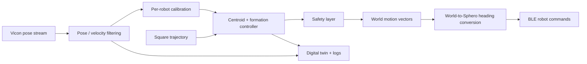

# Sphero + Vicon Swarm Control


A public, hardware-oriented toolkit for controlling **Sphero BOLT/BOLT+ robots mounted in wheeled chariots** with **Vicon motion capture as the external navigation reference**.

The repository is designed for reproducibility rather than a single fixed laboratory setup. Network addresses, robot identifiers, Vicon rigid-body names, operating-area limits, speeds, and geometry live in configuration rather than source code. A simulator and dry-run path let you inspect the workflow before enabling real motion.

> **Safety first:** these scripts can command physical robots. Start at low speed, keep the operating area clear, verify the emergency-stop path, and confirm that every Vicon rigid body maps to the intended robot before closed-loop motion.

## What is included

The codebase follows the natural development path for a multi-robot motion-capture controller:

1. Connect to one Sphero and verify basic motion.
2. Connect to multiple Spheros and verify independent addressing.
3. Read Vicon position/orientation without commanding motion.
4. Calibrate the mapping from Sphero command headings to measured Vicon-world displacement.
5. Close the loop on one chariot.
6. Coordinate three chariots on a Vicon-referenced trajectory.
7. Add formation control, operating-area recovery, collision safeguards, logging, simulation and a live digital twin.

A series of P, PD and PID experiments is documented, but **fixed gains are not presented as universally transferable**. Loaded chariots can differ in static friction, rolling resistance, heading bias, battery state and mechanics. The recommended architecture therefore treats Vicon as navigation truth, calibrates each robot independently and uses bounded state-based correction rather than assuming identical dynamics.

## Repository layout

```text
.
├── config/
│   └── robot_setup.example.toml          # copy to robot_setup.toml and edit
├── examples/                             # staged, readable examples
├── reference_controllers/
│   ├── single_chariot_vicon_circle.py    # preserved single-robot milestone
│   └── three_chariot_square_swarm.py     # feature-rich reference controller
├── src/sphero_vicon_swarm/               # reusable library + CLI
├── tests/                                # hardware-independent tests
├── tools/                                # privacy/release/log utilities
├── docs/                                 # architecture, setup, safety, design notes
├── .github/                              # CI, security, docs, releases, templates
├── mkdocs.yml                            # documentation site
└── pyproject.toml                        # packaging, linting, typing, test config
```

## Quick start: no hardware required

```bash
python -m venv .venv

# Windows PowerShell
.\.venv\Scripts\Activate.ps1

# macOS / Linux
# source .venv/bin/activate

python -m pip install -e ".[dev,docs]"
python -m sphero_vicon_swarm doctor
python -m sphero_vicon_swarm validate-config --config config/robot_setup.example.toml
python -m sphero_vicon_swarm simulate --seconds 8
pytest
```

The feature-rich reference controller also contains a software model:

```bash
python reference_controllers/three_chariot_square_swarm.py \
  --dry-run --timeout 8 --no-digital-twin
```

## Hardware setup

Copy the example configuration and change only your local values:

```bash
cp config/robot_setup.example.toml config/robot_setup.toml
```

On PowerShell:

```powershell
Copy-Item config/robot_setup.example.toml config/robot_setup.toml
```

`config/robot_setup.toml` is ignored by Git so real device names and network addresses are not committed accidentally.

Example:

```toml
[vicon]
server = "127.0.0.1:801"
floor_plane = "XY"

[[robots]]
label = "robot-1"
sphero_name = "YOUR_DEVICE_NAME"
vicon_subject = "Robot 1"
vicon_segment = "Robot 1"

[[robots]]
label = "robot-2"
sphero_name = "YOUR_DEVICE_NAME"
vicon_subject = "Robot 2"
vicon_segment = "Robot 2"

[[robots]]
label = "robot-3"
sphero_name = "YOUR_DEVICE_NAME"
vicon_subject = "Robot 3"
vicon_segment = "Robot 3"
```

Environment variables can override local configuration for automation and temporary experiments. See [Configuration](docs/configuration.md).

## Public Sphero backend

The reusable adapter targets the public [`spherov2`](https://github.com/artificial-intelligence-class/spherov2.py) `SpheroEduAPI`. Install it separately when you want the public BLE backend:

```bash
python -m pip install -e ".[sphero]"
```

Sphero firmware and third-party library support vary, so always run the single-robot smoke test before enabling a multi-robot controller. The repository keeps the robot driver behind a small interface so an alternative compatible backend can be added without changing the control logic.

## Vicon backend

The Vicon adapter uses the vendor DataStream SDK Python bindings (`vicon_dssdk`). Install the DataStream SDK for your platform, then verify the connection with the Vicon-only monitor before commanding a robot.

```bash
python examples/03_vicon_pose_monitor.py --config config/robot_setup.toml
```

Vicon's DataStream SDK is not redistributed here.

## Recommended hardware workflow

Run the stages in order:

```bash
python examples/01_single_sphero_smoke_test.py --config config/robot_setup.toml
python examples/02_multi_sphero_smoke_test.py --config config/robot_setup.toml
python examples/03_vicon_pose_monitor.py --config config/robot_setup.toml
python examples/04_heading_calibration.py --config config/robot_setup.toml
```

Then test the single-chariot closed-loop milestone before a multi-robot run:

```bash
python reference_controllers/single_chariot_vicon_circle.py
```

For the three-chariot controller, first use dry-run, then one low-speed lap:

```bash
python reference_controllers/three_chariot_square_swarm.py --dry-run --timeout 8 --no-digital-twin
python reference_controllers/three_chariot_square_swarm.py --laps 1 --max-speed 160
```

## Why Vicon displacement calibration matters

The Sphero command frame and the Vicon world frame should not be assumed to align. The calibration stage commands two approximately orthogonal Sphero headings and measures the actual Vicon displacement vectors:

```text
Sphero heading 0° ──move──> Vicon world vector e0
Sphero heading 90° ─move──> Vicon world vector e90

Desired Vicon-world direction
            │
            ▼
project onto calibrated basis (e0, e90)
            │
            ▼
Sphero command heading
```

This is robust to mounting orientation and coordinate-frame differences that would otherwise create sideways motion, mirrored steering or persistent path error.

## Controller architecture



The three-robot implementation is **centralised**: one process receives the Vicon states and commands all agents. The behaviour is multi-agent/swarm-like, but it is not presented as a decentralised swarm architecture.

## Quality gates

Local release check:

```bash
python tools/release_check.py
```

It runs:

- Python compilation
- unit tests
- source privacy scan
- repository metadata scan
- reference-controller dry-run

The GitHub workflows add:

- multi-version Python CI
- Ruff lint/format validation
- mypy static typing
- pytest + coverage
- CodeQL analysis
- dependency review on pull requests
- scheduled dependency updates
- documentation build/deploy
- release package build on version tags

## Documentation

- [Getting started](docs/getting-started.md)
- [Configuration](docs/configuration.md)
- [Architecture](docs/architecture.md)
- [Control design](docs/control-design.md)
- [Development history](docs/development-history.md)
- [Hardware setup](docs/hardware-setup.md)
- [Vicon setup](docs/vicon-setup.md)
- [Safety](docs/safety.md)
- [Troubleshooting](docs/troubleshooting.md)
- [Validation](docs/validation.md)
- [GitHub workflow](docs/github-workflow.md)
- [Contributing](CONTRIBUTING.md)
- [Security](SECURITY.md)

## Privacy by design

The public tree intentionally contains no real:

- private-network addresses;
- Bluetooth device identifiers;
- user directory paths;
- names of individuals, workplaces or institutions;
- raw experimental logs containing local paths or identifiers.

Run the privacy scan before every push:

```bash
python tools/privacy_scan.py .
```

## Limitations

- BLE is not hard real-time.
- Chariot friction and battery state can materially change motion response.
- Vicon occlusion, stale frames or incorrect rigid-body mappings can invalidate control.
- Collision and boundary logic are safeguards, not substitutes for a clear physical test area and an operator ready to stop the run.
- The public `spherov2` backend is third-party software; verify compatibility with your specific Sphero model/firmware.
- The reference controller is a research/prototyping implementation, not a safety-certified motion-control product.

## License

MIT. Third-party SDKs and hardware APIs retain their own licences and are not redistributed by this repository.

Sphero and BOLT are trademarks of their respective owner. Vicon is a trademark of Vicon Motion Systems Ltd. This project is independent and is not endorsed by either vendor.
