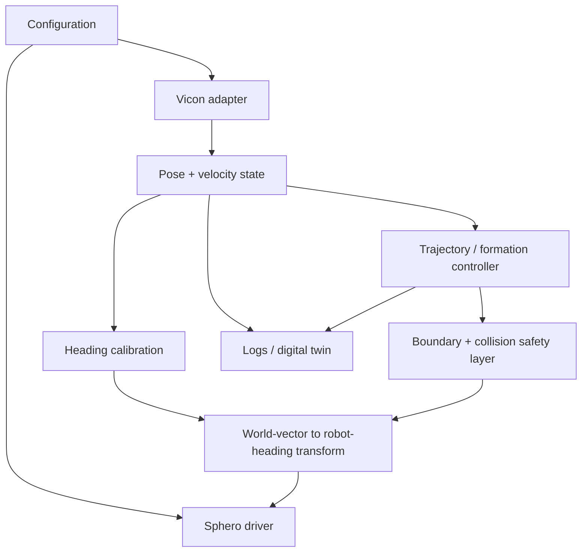

# Architecture

The repository uses a layered structure so sensing, calibration, control, hardware output and diagnostics can be validated separately.

## Separation of concerns

- `config.py` parses only public/local configuration.
- `tracking/vicon.py` owns Vicon SDK calls.
- `drivers/` owns robot API calls.
- `calibration.py` owns coordinate-frame transformation.
- `control.py` operates only on plain Python state objects and is hardware-independent.
- reference controllers preserve full experimental workflows as standalone scripts.

This layout makes the control mathematics testable without BLE or Vicon hardware.
